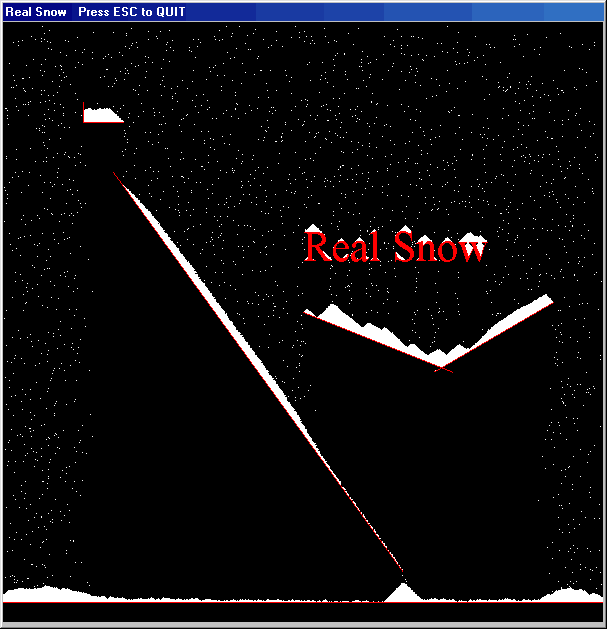

<div align="center">

## Real Snow


</div>

### Description

Its a simple and fast snowfall simulator where the snow stays on every place it whould stay normaly (2,5K Zip). It´s an very old source from me i only comented it for psc.
 
### More Info
 


<span>             |<span>
---                |---
**Submitted On**   |2002-09-03 18:02:02
**By**             |[Scythe](https://github.com/Planet-Source-Code/PSCIndex/blob/master/ByAuthor/scythe.md)
**Level**          |Beginner
**User Rating**    |4.6 (41 globes from 9 users)
**Compatibility**  |VB 5\.0, VB 6\.0
**Category**       |[Graphics](https://github.com/Planet-Source-Code/PSCIndex/blob/master/ByCategory/graphics__1-46.md)
**World**          |[Visual Basic](https://github.com/Planet-Source-Code/PSCIndex/blob/master/ByWorld/visual-basic.md)
**Archive File**   |[Real\_Snow126201932002\.zip](https://github.com/Planet-Source-Code/scythe-real-snow__1-38637/archive/master.zip)

### API Declarations

```
Private Declare Function GetDIBits Lib "gdi32" (ByVal aHDC As Long, ByVal hBitmap As Long, ByVal nStartScan As Long, ByVal nNumScans As Long, lpBits As Any, lpBI As BITMAPINFO, ByVal wUsage As Long) As Long
Private Declare Function SetDIBits Lib "gdi32" (ByVal hdc As Long, ByVal hBitmap As Long, ByVal nStartScan As Long, ByVal nNumScans As Long, lpBits As Any, lpBI As BITMAPINFO, ByVal wUsage As Long) As Long
```


